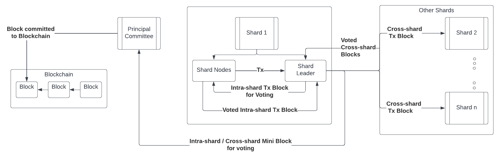

<p align="center">
    
</p>

<hr />

# Basic Overview
ShardEval is a **sharding-based blockchain simulator**. It can be used to simulate protocols for the sharding-based Blockchain systems. ShardEval is built on the top of [BlockEval](https://github.com/deepakgouda/BlockEval).

The complete design and theoretical analysis can be found on [Springer](https://link.springer.com/chapter/10.1007/978-3-031-49099-6_21), accepted by [19th International Conference on Information and Systems Security (ICISS)](https://iciss.isrdc.in/2023/index.html).

Following is a brief representation of the simulator workflow for sharded systems:



# Setup
```bash
cd ShardEval
pip install -r requirements.txt
bash setup.sh
```

# Usage 
The command-line interface for the doc-phi can be used as:

```
 __ _                   _   __            _ 
/ _\ |__   __ _ _ __ __| | /__\_   ____ _| |
\ \| '_ \ / _` | '__/ _` |/_\ \ \ / / _` | |
_\ \ | | | (_| | | | (_| //__  \ V / (_| | |
\__/_| |_|\__,_|_|  \__,_\__/   \_/ \__,_|_|

Usage: shard-eval [OPTIONS] COMMAND [ARGS]...

Options:
  --help  Show this message and exit.

Commands:
  analyze-log           Analyze the generated log files
  batch-run-simulation  Initiate simulations in batches
  execute-simulator     execute simulator completely
  run-simulation        Initiate a simulation
  summarize-logs        Summarize the generated log files
  visualize-file        visualize the generated log files
```

A more elaborate explanation is as follows:

### 1. Running Simulation
The simulation can be executed by:
```
shard-eval run-simulation
```
The simulation executes as per the parameters specified in the
```config/params.json``` file. The result of the simulation are the log files which are stored accordingly in the folder ```simulation_logs```.

**Note:** To generate detailed logs, set ```verbose``` to 1 in the ```params.json``` file.

### 2. Running Simulation in Batch
The simulation can be executed in batch by using following command:
```
shard-eval batch-run-simulation
```

The ```script.py``` file needs to be changed accordingly to generate the logs as per the required parameters.

### 3. Analyzing the logs
The generated log files can be analyzed by:

```
shard-eval analyze-log --log_file=<log_file>
```

Upon execution, several files (html, txt, csv, png) will be created in respective folders inside the ```logs_data``` which will contain a detailed analysis of the log file. 


### 4. Summarizing the logs (in batch)
To create a summary of the logs, following command can be used:

```
shard-eval summarize-logs --log_dir=<logs_directory>
```

A single csv file containing the summary of all the logs will be generated.


### 5. Visualizing the summary of the logs
After creating the summary, the csv file can be visualized using:

```
shard-eval visualize-file --summary_file=<summary_file>
```

Several plots will be created inside the suitable directories under the ```logs_data``` directory.


### 6. End-to-end execution of the simulator
To execute the simulator completely and perform all the steps in an instant, following command can be useful:

```
shard-eval execute-simulator
```

# Citations
If you use this simulator in your research, please cite:

```bib
@InProceedings{10.1007/978-3-031-49099-6_21,
  author = "Priyadarshi, Vishisht and Goel, Sourav and Kapoor, Kalpesh",
  title = "Analysis of Optimal Number of Shards Using ShardEval, A Simulator for Sharded Blockchains",
  booktitle = "Information Systems Security",
  year = "2023",
  publisher = "Springer Nature Switzerland"
}
```